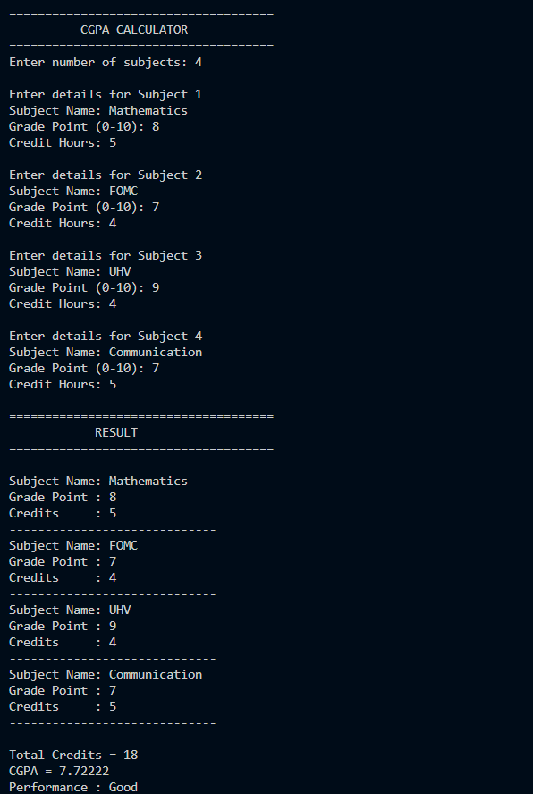

# CodeAlpha CGPA Calculator
A simple C++ project developed as part of the CodeAlpha C++ Programming Internship.

## Features
- Calculates CGPA based on grade points and credit hours
- Accepts multiple subjects
- Displays total credits
- Shows overall performance based on CGPA
- User-friendly console interface

## Technologies Used
- C++
- Visual Studio Code
- GCC Compiler

## How It Works
1. Enter the number of subjects.
2. Enter subject name, grade point, and credit hours.
3. The program calculates:
   - Total Credits
   - CGPA
   - Performance Status
4. Results are displayed on the screen.

## Sample Output

## Author
Dorsi Khan

## Internship
CodeAlpha C++ Programming Internship
